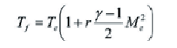

# ponto_de_estagnacao
Estimativa de Carga Térmica em Pontos de Estagnação

Este repositório apresenta o cálculo da temperatura na parede (Tf) de superfícies expostas ao escoamento supersônico, com base na equação empírica da camada limite. A modelagem considera os efeitos da razão de calores específicos, número de Mach e escoamento laminar (r = 0,85). Casos reais como o VLS‑1 ilustram a aplicação prática dos limites térmicos em materiais como o alumínio e a necessidade de proteção térmica em regiões críticas.

A convecção térmica na camada limite do escoamento aerodinâmico é uma das principais fontes de carga térmica em componentes expostos de veículos aeroespaciais. 
Para resistir às altas temperaturas resultantes desse fenômeno, empregam-se materiais isolantes e ablativos em pontos críticos da estrutura.
A temperatura na vizinhança do ponto de estagnação, especialmente em superfícies frontais ao fluxo de ar, pode ser estimada pela seguinte equação:

======================================
Exemplo de uso:
Se o veículo estiver a Mach = 2 e a temperatura do ar for 0 ºC (273 K)
o temperatura da parede será de 185 ºC. 
Ja em em Mach = 3, a temperatura será de  ~417 ºC.
=======================================

Tais temperaturas excedem a resistência térmica do alumínio, que começa a perder suas propriedades mecânicas em torno de 100 ºC. 
Por isso, nas regiões onde há estagnação do escoamento supersônico — como nariz da coifa, bordos de ataque de empenas ou em torno de protuberâncias, é necessário empregar proteções térmicas especiais sobre o alumínio ou utilizar materiais ablativos diretamente.

## Licença

Este projeto está licenciado sob a Licença MIT. Você pode usar, modificar e redistribuir este código livremente, desde que mencione o autor original.

[Clique aqui para ver a licença completa.](https://opensource.org/licenses/MIT)
